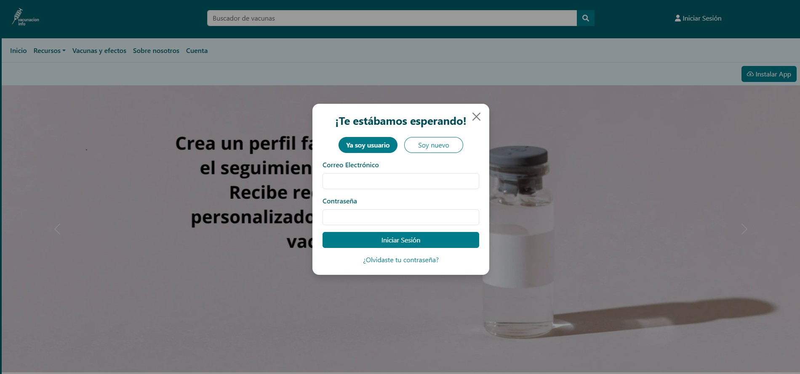
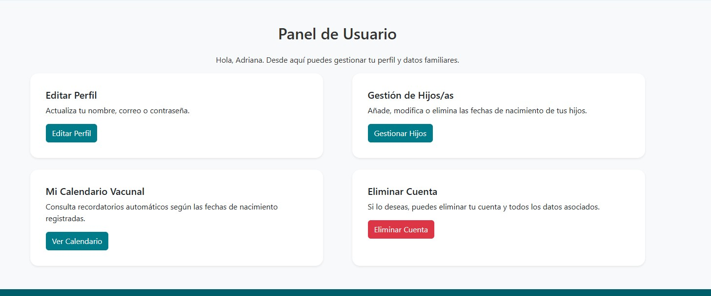
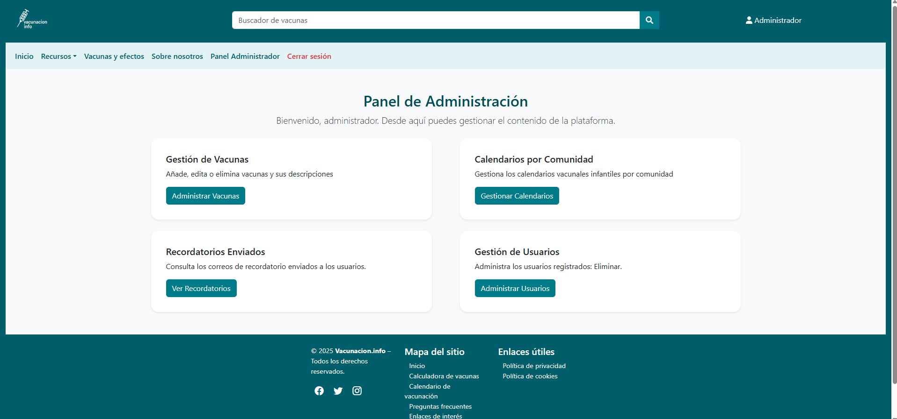

<h1 align="center">💉 vacunacion.info</h1>

  <b>Stack:</b> PHP · MySQL · JavaScript · AWS 
  <b>Arquitectura:</b> MVC · API externa (Brevo) 
  <b>Funcionalidades clave:</b> Autenticación · Emails automáticos · Panel admin

  <b>Gestión inteligente del calendario vacunal infantil en España</b> 
  Recordatorios automáticos · Personalización por comunidad · PWA

  <!-- Demo y vídeo -->
  
  

  <!-- Estado del proyecto -->
  
  
  

  <!-- Tecnologías -->
  
  
  
  
  
  
  
  

---

<h2>🚀 Descripción</h2>

<code>vacunacion.info</code> es una aplicación web diseñada para facilitar el seguimiento del calendario vacunal infantil en España, adaptándose automáticamente a la comunidad autónoma del usuario.

El sistema permite gestionar el historial vacunal de menores y automatizar recordatorios, mejorando la adherencia a los calendarios oficiales y reduciendo olvidos.

---

<h2>🎯 Problema que resuelve</h2>

<ul>
  <li>Diferencias entre calendarios vacunales por comunidad autónoma</li>
  <li>Falta de recordatorios centralizados y automatizados</li>
  <li>Dificultad para mantener un seguimiento actualizado</li>
</ul>

<h3>👨‍👩‍👧 Para familias</h3>
<ul>
  <li>Seguimiento completo de vacunación (0–18 años)</li>
  <li>Recordatorios automáticos antes de cada vacuna</li>
  <li>Adaptación dinámica al cambiar de comunidad</li>
</ul>

<h3>🏥 Para profesionales sanitarios</h3>
<ul>
  <li>Consulta del estado vacunal</li>
  <li>Registro y actualización de vacunas</li>
  <li>Mejora de la continuidad asistencial</li>
</ul>

---

<h2>✨ Funcionalidades principales</h2>

<ul>
  <li>👶 Gestión de perfiles de menores</li>
  <li>📅 Calendario vacunal personalizado por comunidad</li>
  <li>📧 Sistema de recordatorios automatizados (30, 14 y 7 días)</li>
  <li>🔐 Sistema completo de autenticación (login, registro, recuperación)</li>
  <li>🔎 Buscador con autocompletado</li>
  <li>📱 Instalación como Progressive Web App (PWA)</li>
  <li>Panel de administración</li>
  <li>Gestión de vacunas</li>
  <li>Actualización de calendarios</li>
  <li>Eliminación de registros obsoletos</li>
</ul>

---

<h2>📧 Sistema de notificaciones (API Brevo)</h2>

<ul>
  <li>Integración mediante peticiones HTTP desde el backend en PHP</li>
  <li>Envío automático de emails en función de fechas de vacunación</li>
  <li>Personalización de mensajes según usuario</li>
  <li>Uso de API Key para autenticación segura</li>
  <li>Control de errores en el envío</li>
  <li>Registro de logs del estado de los envíos (éxito / error)</li>
  <li>Trazabilidad de recordatorios para control de duplicados y auditoría</li>
</ul>

Este sistema permite una comunicación fiable, escalable y orientada a eventos.

---

<h2>🧰 Stack tecnológico</h2>

<ul>
  <li><b>Frontend:</b> HTML5 · CSS3 · JavaScript · Bootstrap</li>
  <li><b>Backend:</b> PHP (MVC)</li>
  <li><b>Base de datos:</b> MySQL</li>
  <li><b>Infraestructura:</b> AWS Lightsail · Apache</li>
  <li><b>Otros:</b> Composer · Brevo (email API) · PWA</li>
</ul>

---

<h2>🏗️ Arquitectura</h2>

<pre>
models/       → acceso a datos
controllers/  → lógica de negocio
views/        → interfaz de usuario
public/       → assets y recursos públicos
json/         → datos estructurados de vacunas
</pre>

<h2>⚙️ Decisiones técnicas</h2>

<ul>
  <li>Uso de MVC para mejorar mantenibilidad y escalabilidad</li>
  <li>Integración con API externa (Brevo) para delegar el envío de emails</li>
  <li>Implementación como PWA para mejorar accesibilidad móvil</li>
  <li>Uso de AWS Lightsail para un despliegue sencillo y controlado</li>
</ul>

---

<h2>🔐 Seguridad</h2>

<ul>
  <li>Almacenamiento seguro de contraseñas mediante hashing</li>
  <li>Validación y sanitización de inputs en cliente y servidor</li>
  <li>Protección frente a SQL Injection</li>
  <li>Prevención de ataques XSS</li>
  <li>Gestión segura de sesiones de usuario</li>
</ul>

---

<h2>🧪 Testing</h2>

<ul>
  <li>Validación de formularios</li>
  <li>Verificación de flujos de autenticación</li>
  <li>Pruebas de envío de recordatorios</li>
  <li>Comprobación de interacción entre módulos</li>
</ul>

Actualmente no se han implementado tests automatizados, pero se plantea como mejora futura.

---

<h2>📊 Diagramas del sistema</h2>

El proyecto ha sido diseñado mediante modelado UML:

<ul>
  <li>Diagrama de casos de uso</li>
  <li>Diagrama de clases</li>
  <li>Modelo entidad-relación (base de datos)</li>
</ul>

Estos diagramas reflejan la estructura del sistema, las relaciones entre entidades y el flujo de interacción.

---

<h2>🚀 Despliegue</h2>

<ul>
  <li>Servidor en AWS Lightsail (Bitnami + Apache)</li>
  <li>Configuración de dominio propio</li>
  <li>Redirección automática a HTTPS</li>
  <li>Despliegue manual mediante SCP</li>
</ul>

<h2>💻 Ejecución local</h2>

<pre>
git clone https://github.com/adrianaarang/vacunacion.info
cd vacunacion.info
</pre>

Configurar servidor local (XAMPP / Apache), base de datos MySQL y variables de entorno (API Key de Brevo).

---

<h2>📸 Capturas</h2>

    
    
    

---

<h2>🧠 Aprendizajes</h2>

<ul>
  <li>Diseño de arquitectura MVC desde cero</li>
  <li>Implementación de autenticación y gestión de sesiones</li>
  <li>Integración con APIs externas (Brevo)</li>
  <li>Automatización de procesos (emails programados)</li>
  <li>Despliegue en entorno cloud (AWS)</li>
  <li>Desarrollo de aplicaciones PWA</li>
</ul>

---

<h2>🚧 Mejoras futuras</h2>

<ul>
  <li>Desarrollo de API REST desacoplada</li>
  <li>Migración a frontend moderno (React / Vue)</li>
  <li>Notificaciones push</li>
  <li>Tests automatizados</li>
  <li>Monitorización y logs avanzados</li>
</ul>

<h3>🌍 Nueva línea de desarrollo</h3>

<ul>
  <li>Extensión a vacunación internacional (viajeros)</li>
  <li>Recomendaciones según destino</li>
  <li>Integración con organismos sanitarios (OMS, CDC)</li>
</ul>

---

<h2>👩‍💻 Autor</h2>

  <b>Adriana Aránguez García</b>  
  
  

---

<h2>📊 Métricas del repositorio</h2>

  
  
  
  

